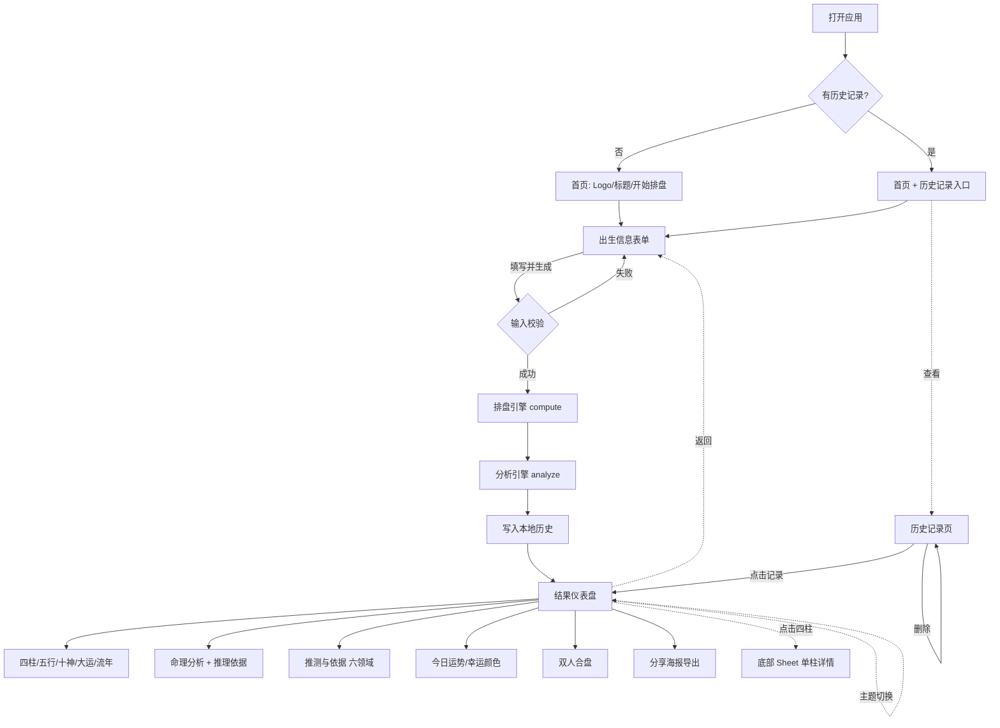
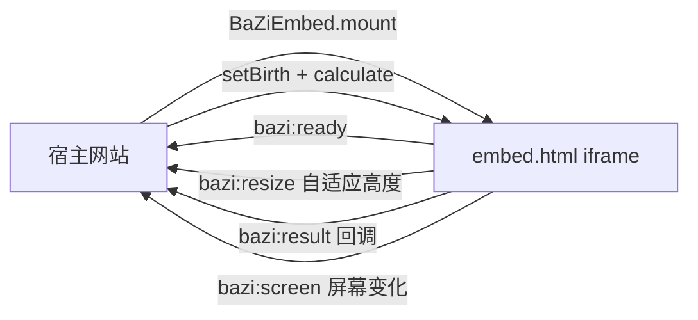
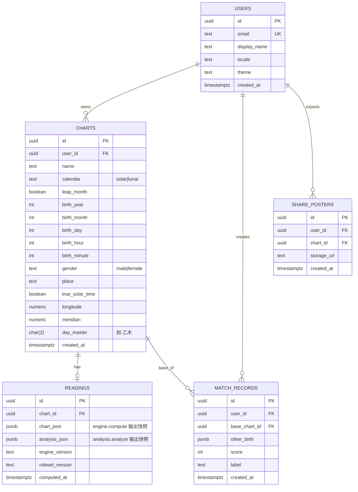

# BaZi · 产品需求文档（PRD）

> 版本：v1.0　|　文档状态：与当前代码同步　|　适用产品：BaZi 现代八字数据仪表盘
>
> 一句话定位：用现代数据可视化方式，把中国传统历法与八字结构呈现为一个冷静、专业、可审计的数据分析产品——不是算命软件。
>
> 重要声明：本产品的所有解读与推测均为**传统命理规则的程序化推演**，属于文化与分析框架，**非科学预测**。每一条结论在页面上都附带依据与置信度，便于用户自行判断。

---

## 目录

1. [项目概览](#1-项目概览)
2. [竞品分析](#2-竞品分析)
3. [用户画像](#3-用户画像)
4. [功能需求](#4-功能需求)
5. [用户流程图](#5-用户流程图)
6. [页面结构](#6-页面结构)
7. [页面设计文档](#7-页面设计文档)
8. [算法设计文档](#8-算法设计文档)
9. [数据库设计](#9-数据库设计)
10. [开发计划](#10-开发计划)

---

## 1. 项目概览

### 1.1 背景与问题

传统排盘网站普遍存在三个问题：界面陈旧、信息过载（满屏神煞与术语）、以及把不确定的命理推断包装成确定性的"算命结论"。这既不专业，也不可信。

BaZi 的切入点是：**保留东方文化气质，但用现代数据产品的语言重构八字**。用户第一次打开时应联想到 Apple Health、Robinhood、Notion，而不是传统命理站。

### 1.2 产品定位

| 维度 | 定位 |
| --- | --- |
| 它是什么 | 中国传统历法 + 干支体系的**结构化数据分析与可视化工具** |
| 它不是什么 | 算命软件、风水软件、玄学工具、传统命理网站 |
| 气质关键词 | Professional / Minimal / Elegant / Trustworthy / Calm / Data-Driven |
| 视觉参考 | MUJI、Apple、Nothing、Robinhood |
| 信任策略 | 结论可审计：每条解读/推测都显示规则依据、古籍来源与置信度 |

### 1.3 核心价值主张

- **准确的排盘**：基于真实节气天文计算（lunar-javascript），四柱、大运起运、农历换算、真太阳时校正均按天文历法处理，而非近似。
- **透明的解读**：采用子平"扶抑法"为主线，旺衰、用神、格局、十神、岁运逐层推演，并标注《子平真诠》《滴天髓》《三命通会》《渊海子平》等来源。
- **有依据的推测**：事业、财富、感情、学业、健康、时机六大领域的倾向性判断，每一条都附"依据"。
- **冷静的体验**：8pt 栅格、留白、渐进动画、明暗主题；默认折叠次要信息，数据优先。

### 1.4 当前实现状态（v1.0）

全部为**纯前端 + 本地规则引擎**，无后端依赖，可离线运行；可独立部署，也可通过 iframe / JS SDK 嵌入第三方网站。

| 能力 | 状态 |
| --- | --- |
| 公历/农历输入、真太阳时校正 | ✅ 已实现 |
| 四柱 / 藏干 / 十神 / 纳音 / 五行结构 / 大运 / 流年 / 今日 | ✅ 已实现 |
| 扶抑旺衰、用神喜忌、格局、地支关系、置信度 | ✅ 已实现 |
| 六领域推测（每点带依据） | ✅ 已实现 |
| 今日运势、幸运颜色、双人合盘、分享海报 | ✅ 已实现 |
| 历史记录（本地） | ✅ 已实现 |
| 明暗主题、五行雷达图 | ✅ 已实现 |
| 嵌入 SDK（postMessage / 自适应高度）、静态服务 | ✅ 已实现 |
| 账号体系、云端同步、付费 | ⏳ 规划中 |

### 1.5 技术栈

| 层 | 选型 | 说明 |
| --- | --- | --- |
| 运行形态 | 纯静态前端（无构建步骤） | 原生 ES5+ JavaScript，单文件可直接 `file://` 打开 |
| 历法计算 | lunar-javascript (6tail, MIT) | 节气、四柱、胎元、命宫、农历换算，已 vendored 离线 |
| 渲染 | 原生 DOM + CSS 变量主题 | 无框架依赖，约束体积与加载成本 |
| 可视化 | SVG / Canvas | 五行雷达、进度条、分享海报（Canvas 1080×1440） |
| 本地存储 | localStorage | 历史记录、主题偏好 |
| 嵌入 | iframe + window.postMessage | `embed-host.js` 提供宿主 SDK，自适应高度 |
| 服务 | Node `http`（`server.js`） | 零依赖静态服务，支持 `.env.local` 配置 HOST/PORT |

---

## 2. 竞品分析

### 2.1 竞品概览

| 产品 | 类型 | 优势 | 短板 | 与 BaZi 的差异 |
| --- | --- | --- | --- | --- |
| 测测 / 测测星座 | App，泛玄学社交 | 用户量大、内容丰富、社区活跃 | 重运营与付费咨询、玄学氛围浓、信息过载 | BaZi 去玄学化、强调可审计与数据可视化 |
| 问真八字 | App，专业排盘 | 排盘准确、专业向、功能全 | 界面偏传统、术语密集、学习门槛高 | BaZi 同样追求准确，但界面与信息层级面向大众 |
| 知命 / 各类小程序 | 小程序，轻量算命 | 上手快、社交裂变强 | 结论"黑箱"、付费解锁、隐私存疑 | BaZi 结论透明、附依据，前端可离线，不强制账号 |
| elements.cafe / Karmic 等海外 | Web，现代设计 | 设计现代、英文体验好 | 多为西占/MBTI 风格，八字深度不足 | BaZi 专注中式八字深度 + 现代设计的结合 |
| 传统排盘网站（如 8z 类） | Web，工具 | 信息全、免费 | 界面陈旧、广告多、移动端差 | BaZi 在工具准确性之上重构体验 |

### 2.2 竞争象限

```text
              专业/准确  ↑
                        │   ● 问真八字        ● BaZi(目标位)
                        │
   传统/重术语 ──────────┼────────────── 现代/数据化
                        │   ● 传统排盘站
                        │            ● 测测   ● 知命小程序
              娱乐/轻量  ↓
```

BaZi 的目标占位：**右上象限——同时具备专业准确性与现代数据化体验**，这是目前市场相对空白的位置。

### 2.3 差异化策略

1. **可审计的解读**：唯一系统性地为每条结论提供"依据 + 古籍来源 + 置信度"的产品，把"算命"重构为"可解释的结构分析"。
2. **去玄学的视觉语言**：拒绝龙凤、太极、八卦盘、金色浮雕；用 MUJI/Apple 风格降低神秘感、提升信任。
3. **历法准确性**：真太阳时（经度 + 均时差）、农历闰月换算、节气定月、起运天文计算，达到专业级。
4. **可嵌入**：提供 iframe + JS SDK，可作为组件嵌入媒体、教育、文化类网站，形成 B 端分发。

---

## 3. 用户画像

### 3.1 Persona A — 好奇的都市青年「林悦」

| 项 | 内容 |
| --- | --- |
| 年龄/职业 | 26，一线城市互联网运营 |
| 设备 | 主用手机，审美在线，常用 Notion / 小红书 |
| 诉求 | 想了解自己的八字与"今日运势"，但讨厌迷信氛围和满屏术语 |
| 行为 | 碎片化使用，愿意分享好看的结果到社交平台 |
| 关键功能 | 首页 3 秒理解、今日运势、幸运颜色、分享海报、明暗主题 |
| 成功标准 | 30 秒内得到一份"好看且能看懂"的结果并愿意分享 |

### 3.2 Persona B — 命理学习者「陈default」

| 项 | 内容 |
| --- | --- |
| 年龄/职业 | 34，对命理有系统兴趣的自学者 |
| 诉求 | 需要准确排盘 + 能看到推断"为什么"，用于学习与验证 |
| 行为 | 深度使用，会逐项展开藏干、神煞、地支关系、置信度 |
| 关键功能 | 扶抑旺衰推理、用神喜忌、格局透干、地支合冲刑害、古籍来源、真太阳时 |
| 成功标准 | 结论可追溯到规则与古籍，能与自己的判断交叉验证 |

### 3.3 Persona C — 文化/教育内容方「Studio Mu」

| 项 | 内容 |
| --- | --- |
| 类型 | 文化媒体 / 教育平台 / 设计工作室（B 端） |
| 诉求 | 想在自有网站嵌入一个"高级感"的八字工具丰富内容 |
| 行为 | 关注可嵌入性、主题适配、隐私合规、加载性能 |
| 关键功能 | iframe / JS SDK、URL 参数、自适应高度、明暗主题、无强制账号 |
| 成功标准 | 一段代码完成嵌入，风格与自有站点一致，无隐私风险 |

### 3.4 Persona D — 送礼/关系探索者「Aki」

| 项 | 内容 |
| --- | --- |
| 诉求 | 想看自己与伴侣/朋友的"合盘"作为轻松话题 |
| 关键功能 | 双人合盘评分与解读、分享海报 |
| 成功标准 | 得到一个有趣、可分享、不武断的关系结构参考 |

---

## 4. 功能需求

优先级定义：**P0** 核心不可缺；**P1** 重要增强；**P2** 锦上添花/规划。

### 4.1 输入模块（出生信息）

| 编号 | 需求 | 优先级 | 状态 |
| --- | --- | --- | --- |
| IN-1 | 姓名/称呼（可空，用作历史标签与结果标题） | P1 | ✅ |
| IN-2 | 公历/农历切换，农历支持闰月 | P0 | ✅ |
| IN-3 | 出生日期、时间输入 | P0 | ✅ |
| IN-4 | 性别（影响大运顺逆与夫/妻星） | P0 | ✅ |
| IN-5 | 出生地点：126 城市可搜索下拉 | P1 | ✅ |
| IN-6 | 真太阳时开关；开启后显示可编辑经度与时区标准经线 | P1 | ✅ |
| IN-7 | 表单卡片化、分区独立，避免传统表单观感 | P1 | ✅ |

### 4.2 排盘引擎模块

| 编号 | 需求 | 优先级 | 状态 |
| --- | --- | --- | --- |
| EN-1 | 四柱（年/月/日/时），按节气定月、晚子时处理 | P0 | ✅ |
| EN-2 | 藏干、天干地支十神、纳音、十二长生、空亡、胎元、命宫 | P0 | ✅ |
| EN-3 | 五行结构（加权百分比，总和=100） | P0 | ✅ |
| EN-4 | 大运（顺逆 + 起运天文计算）、流年、今日 | P0 | ✅ |
| EN-5 | 真太阳时（经度 + 均时差）校正 | P1 | ✅ |
| EN-6 | 常见神煞（天乙、文昌、禄神、羊刃、桃花、驿马、华盖、将星） | P1 | ✅ |

### 4.3 分析与推测模块

| 编号 | 需求 | 优先级 | 状态 |
| --- | --- | --- | --- |
| AN-1 | 日主旺衰（扶抑法）+ 量化指数 + 推理依据 | P0 | ✅ |
| AN-2 | 用神/喜忌 + 依据 | P0 | ✅ |
| AN-3 | 格局（月令透干优先，本气兜底） | P1 | ✅ |
| AN-4 | 地支关系（六合/冲/害/破/刑/三合/三会/自刑） | P1 | ✅ |
| AN-5 | 性格特质、事业财富倾向（基于十神） | P1 | ✅ |
| AN-6 | 大运/流年吉凶倾向（喜忌增量评分 + 徽标） | P0 | ✅ |
| AN-7 | 六领域推测（事业/财富/感情/学业/健康/时机），每点带依据 | P0 | ✅ |
| AN-8 | 古籍来源库、方法论说明、置信度（高/中/需复核） | P1 | ✅ |

### 4.4 互动与传播模块

| 编号 | 需求 | 优先级 | 状态 |
| --- | --- | --- | --- |
| EX-1 | 今日运势：四领域星级 + 文案 | P1 | ✅ |
| EX-2 | 幸运颜色（基于喜用 + 当日干支） | P2 | ✅ |
| EX-3 | 双人合盘：0–100 评分 + 多维解读 | P1 | ✅ |
| EX-4 | 分享海报（Canvas 导出图片） | P2 | ✅ |
| EX-5 | 点击四柱弹出底部 Sheet 查看单柱详情 | P1 | ✅ |
| EX-6 | 历史记录：本地保存 / 列表 / 重开 / 删除，上限 30 | P1 | ✅ |

### 4.5 平台与嵌入模块

| 编号 | 需求 | 优先级 | 状态 |
| --- | --- | --- | --- |
| PL-1 | 明暗主题切换并记忆 | P1 | ✅ |
| PL-2 | iframe 嵌入页 `embed.html` + URL 参数 | P1 | ✅ |
| PL-3 | JS SDK `BaZiEmbed.mount()`：setTheme/setBirth/calculate/reset/destroy | P1 | ✅ |
| PL-4 | postMessage 自适应高度、ready/screen/result 回调 | P1 | ✅ |
| PL-5 | 零依赖静态服务（`server.js`，`.env.local` 配置） | P2 | ✅ |
| PL-6 | 账号体系 / 云端同步 / 导出 | P2 | ⏳ |

---

## 5. 用户流程图

### 5.1 主流程



### 5.2 嵌入方流程（B 端）



---

## 6. 页面结构

### 6.1 信息架构

```text
BaZi App (单页应用，screen 状态切换)
├── 首页 Home
│   ├── Logo / 标题 / 副标题
│   ├── [开始排盘] 主按钮
│   └── [历史记录(n)] 次按钮（有记录时显示）
├── 出生信息 Form
│   ├── 姓名/称呼
│   ├── 历法（公历/农历 + 闰月）
│   ├── 出生日期 / 出生时间
│   ├── 性别（分段控件）
│   ├── 出生地点（可搜索）
│   ├── 真太阳时（开关 → 经度 / 标准经线）
│   └── [生成排盘]
├── 结果仪表盘 Result
│   ├── Hero（姓名/出生信息/日主大字）
│   ├── 四柱卡片 ×4（点击 → 底部 Sheet）
│   ├── 五行分布（进度条 + 雷达图）
│   ├── 十神（标签）
│   ├── 大运（横向时间轴 + 吉凶徽标）
│   ├── 流年（年份步进 + 增强五行 + 吉凶）
│   ├── 今日运势 / 幸运颜色
│   ├── 双人合盘
│   ├── 分享海报
│   ├── 命理分析（旺衰/用神/格局/平衡/性格/事业/大运，可展开依据）
│   ├── 推测与依据（六领域，每点带依据）
│   └── 更多（纳音/神煞/十二长生/空亡·胎元·命宫，默认折叠）
├── 历史记录 History
│   └── 记录卡片列表（重开 / 删除 / 空态）
└── 全局：顶栏（返回 / 历史 / 主题）、底部 Sheet 容器
```

### 6.2 屏幕与触发

| 屏幕 | 进入方式 | 退出/跳转 |
| --- | --- | --- |
| Home | 应用启动 | → Form、→ History |
| Form | 首页按钮 / 结果返回 | → Result（提交）、← Home |
| Result | 表单提交 / 历史重开 | ← Form、→ History、内部 Sheet |
| History | 顶栏图标 / 首页按钮 | → Result（重开）、← Home/Result |
| Bottom Sheet | 点击四柱 | 点击遮罩关闭 |

---

## 7. 页面设计文档

### 7.1 设计原则

- **Less is More**：减少视觉噪音，只展示当前需要的信息，次要内容默认折叠。
- **Information First**：数据优先，先四柱/五行/十神/大运，解读其次。
- **Calm Interface**：冷静、舒适、专业，而非神秘、夸张、恐吓。
- **Modern Eastern**：保留东方气质，但不用龙凤/太极/八卦盘/祥云/金色浮雕。

### 7.2 设计令牌（Design Tokens）

**浅色主题**

| 令牌 | 值 |
| --- | --- |
| 背景 | `#FAFAFA` |
| 卡片 | `#FFFFFF` |
| 主文本 | `#111111` |
| 次文本 | `#666666` |
| 分隔线 | `#ECECEC` |
| 强调色 | `#4F46E5` |

**深色主题**

| 令牌 | 值 |
| --- | --- |
| 背景 | `#0F1115` |
| 卡片 | `#171A21` |
| 主文本 | `#F5F5F5` |
| 次文本 | `#A0A0A0` |
| 强调色 | `#6366F1` |

**五行色（克制、低饱和）**：木 `#4B9E7E`、火 `#D9694E`、土 `#C9A35B`、金 `#8C93A0`、水 `#5B7FB0`（深色主题各自微调提亮）。

### 7.3 排版（参考 Apple HIG）

| 角色 | 字号/字重 |
| --- | --- |
| Title | 32pt Bold（首页 40pt、日主大字 48pt） |
| Section Title | 20pt Semibold |
| Body | 16pt Regular |
| Caption | 13pt Regular |

字体栈：`SF Pro Display / SF Pro Text`，中文 `PingFang SC`。

### 7.4 栅格与间距

8pt 栅格系统，间距阶梯：`4 / 8 / 12 / 16 / 24 / 32 / 48`。圆角：卡片 18px、小卡 12px。原则：大量留白，不塞满，让内容呼吸。

### 7.5 关键组件规范

| 组件 | 规范要点 |
| --- | --- |
| 四柱卡片 | 参考 Robinhood 资产卡；干/支按五行着色；点击上浮、按下缩放；触发底部 Sheet |
| 五行进度条 | 水平条，宽度 0→目标值 1s 缓动，百分比数字 0→N 计数动画 |
| 五行雷达 | SVG 五边形雷达，渐进绘制 |
| 十神标签 | GitHub 风格 Tag，重复者带计数徽标 |
| 大运时间轴 | 横向可滑动，自动居中当前大运；每格带"有利/平稳/不利"徽标 |
| 流年面板 | 参考 Apple Stocks，年份步进器 + 增强五行 ↑/→ + 吉凶 |
| 命理分析卡 | 结论 + 药丸标签 + 可展开"推理依据"（＋/－ 折叠） |
| 推测卡 | 每条结论下方常驻"依据：…"小字（提示类不带依据） |
| 底部 Sheet | 单柱详情：天干/阴阳/十神/藏干/十二长生；遮罩 + 上滑进场 |
| 分享海报 | Canvas 1080×1440，含四柱/日主/五行/今日趋势，导出 PNG |

### 7.6 动效

| 动效 | 时长/方式 |
| --- | --- |
| 卡片淡入 | 200ms |
| 页面切换 | 300ms |
| 数字滚动 | 0 → N（cubic-out） |
| 图表加载 | 渐进式 |
| 缓动曲线 | `cubic-bezier(0.32,0.72,0,1)` |

**禁止**：金光、粒子、闪烁、八卦旋转、风水特效。尊重 `prefers-reduced-motion`。

### 7.7 可访问性

明暗双主题对比度达标；触控目标≥34px；雷达/星级提供 `aria-label`；动效可降级。

---

## 8. 算法设计文档

> 所有算法位于 `assets/engine.js`（历法与排盘）与 `assets/analysis.js`（解读与推测），均为确定性纯函数，无随机、无网络。

### 8.1 排盘管线（engine.compute）

```text
输入 {calendar, 闰月, 年月日时分, 性别, 地点, 真太阳时, 经度, 标准经线}
  │
  ├─[农历?] Lunar.fromYmdHms(年, ±月, 日…).getSolar() → 换算为公历
  │
  ├─[真太阳时?] 校正：见 8.2
  │
  ├─ Solar→Lunar→EightChar（lunar-javascript，按节气定月）
  │
  ├─ 四柱：干/支/藏干/十神/十二长生
  ├─ 五行结构：加权百分比（见 8.3）
  ├─ 十神统计：去重计数
  ├─ 大运：getYun(性别) 顺逆 + 起运（过滤空干支）
  ├─ 神煞：查表（见 8.5）
  └─ 隐藏项：纳音/十二长生/空亡/胎元/命宫
```

### 8.2 真太阳时校正

```text
meanCorrection = (经度 − 标准经线) × 4   // 分钟，每度 4 分钟
EoT = 9.87·sin(2B) − 7.53·cos(B) − 1.5·sin(B)   // 均时差，B = 2π(N−81)/364，N=年内第几天
真太阳时 = 钟表时间 + meanCorrection + EoT
```

通过儒略日加减分钟实现，避免时区误差；可能改变时柱乃至跨节气的月柱。

### 8.3 五行加权分布

```text
每个天干 → 其五行 +1.0
每个地支 → 藏干按 [主气 1.0, 中气 0.5, 余气 0.2] 加到对应五行
归一化为百分比，使用"最大余数法"保证总和恰为 100
```

> 说明：该百分比是**用于可视化的结构指数**，不是古籍固定计分法（页面已注明）。

### 8.4 十神推导

以日干为基准，对比目标天干的五行生克关系与阴阳同异：

| 关系 | 同阴阳 | 异阴阳 |
| --- | --- | --- |
| 同我（同五行） | 比肩 | 劫财 |
| 我生 | 食神 | 伤官 |
| 我克 | 偏财 | 正财 |
| 克我 | 七杀 | 正官 |
| 生我 | 偏印 | 正印 |

### 8.5 神煞（确定性查表）

天乙贵人、文昌贵人、禄神（按日干）；羊刃（阳日干）；桃花/驿马/华盖/将星（按日支与年支三合组）。命中即标注落于哪一柱。

### 8.6 日主旺衰（扶抑法，analysis.strength）

```text
support, drain = 0
月令(月支五行)相对日主：得令(比劫/印)记 support，否则 drain
逐柱累计：天干权重 1；藏干 [1.0,0.5,0.2]；月柱整体 ×2
日主自身记 support +1
ratio = support / (support + drain)

分级：
  ratio < 0.25            从弱/极弱  veryWeak
  0.25 ≤ ratio < 0.42     身弱      weak
  0.42 ≤ ratio ≤ 0.58     中和      balanced
  0.58 < ratio ≤ 0.75     身强      strong
  ratio > 0.75            从强/极强  veryStrong
```

输出包含 support/drain 数值、百分比、分级、推理依据数组、**置信度**与模型说明。

### 8.7 用神 / 喜忌（analysis.yongShen）

```text
身弱  → 喜 印+比劫，忌 食伤+财+官杀
身强  → 喜 食伤+财+官杀，忌 印+比劫
中和  → 喜 食伤+财（流通优先），忌 官杀
极弱/极强 → 提示可能从格/专旺，置信度降级，需人工复核
```

### 8.8 格局（analysis.geJu）

优先取**月令藏干中已透干者**的十神立格（如正官格、食神格）；若无透干，则以月令本气兜底，并相应降低置信度。

### 8.9 地支关系（analysis.branchRelations）

两两检测六合、冲、害、破、刑；并检测三合局、三会方（≥2 为半合/半会，3 为成局）与自刑（辰午酉亥同见）。作为旺衰与气势的辅助权重提示。

### 8.10 岁运吉凶评分

```text
favorOfElements(该柱五行集合, 用神):
  喜用元素 +1，忌神元素 −1，其余 0
  score > 0 → 有利；< 0 → 不利；= 0 → 平稳
大运逐柱评分；流年/今日同理（取年/日干支的干元素与支主气元素）
```

### 8.11 今日运势领域星级（domainScores）

```text
基线 = 3 + (当日 favorScore 方向 ±1)
若当日干/支十神落入领域相关十神集合，对应 +1
裁剪到 [1,5]，映射为 ★ 星级
领域：事业/财运/感情/行动
```

### 8.12 幸运颜色

按"当日干支元素 + 命局喜用元素"取色，从五行色板中挑选最多 3 个（去重）。

### 8.13 双人合盘评分（compatibilityResult）

```text
基线 58
日主关系：相生 +14 / 同类 +8 / 相克 −8 / 无关 0
日支互动：六合 +13 / 冲 −14 / 害 −8 / 平 +2
五行结构相似度：similarity = 100 − Σ|各元素百分比差|；score += (similarity−50)×0.18
喜用互补：任一方日主落入对方喜用 +8
裁剪到 [20,96]；分段标签：高协同/互补可发展/需要磨合/结构张力较高
```

### 8.14 六领域推测（analysis.infer）

基于十神计数、日支配偶宫喜忌、夫/妻星（女看官杀、男看财）、神煞、五行偏枯、岁运，产出事业/财富/感情/学业/健康/时机的倾向性条目；**每条都携带 basis 依据数组**，提示类条目不含依据。健康条目明确标注"非医疗诊断"。

### 8.15 置信度模型

每层（旺衰/用神/格局/地支关系）各自给出"较高/中等/需复核"，并汇总为整体置信度；接近分界、可能从格、地支干扰均触发降级。配套"古籍来源库"与"方法论说明"，使结论可追溯。

---

## 9. 数据库设计

### 9.1 现状：客户端存储（v1.0，无后端）

当前所有数据保存在浏览器 `localStorage`，不出本机：

| Key | 类型 | 内容 | 说明 |
| --- | --- | --- | --- |
| `bazi-history` | JSON 数组 | 历史排盘记录 | 最多 30 条，去重 + 置顶 |
| `bazi-theme` | 字符串 | `light` / `dark` | 主题偏好 |

**history 记录结构**

```jsonc
{
  "name": "小明",
  "year": 1996, "month": 5, "day": 18, "hour": 9, "minute": 30,
  "gender": "男",
  "place": "上海",
  "trueSolarTime": false,
  "longitude": 121.47,
  "meridian": 120,
  "dayMaster": "乙木",   // 用于列表着色徽标
  "savedAt": 1718500000000
}
```

去重键：`year-month-day-hour-minute-gender-place-trueSolarTime`。

### 9.2 规划：服务端关系型设计（v2，账号/同步/付费）

当引入账号体系与云端同步后，建议 PostgreSQL 模式如下（解读结果可缓存以降低重复计算）：



设计要点：

- **READINGS 用 JSONB 缓存**引擎/分析快照，并记录 `engine_version` 与 `ruleset_version`，便于规则升级后区分历史结果。
- 排盘输入与"派生结果"分离（CHARTS vs READINGS），保证可重算与可追溯。
- 隐私：出生信息为敏感数据，需加密存储、最小化收集、提供导出与删除（合规：个人信息保护）。
- 索引：`CHARTS(user_id, created_at)`、`READINGS(chart_id)`、唯一约束 `USERS(email)`。

---

## 10. 开发计划

### 10.1 里程碑

| 阶段 | 目标 | 主要交付 | 状态 |
| --- | --- | --- | --- |
| M0 引擎与排盘 | 准确排盘 | engine.js（四柱/五行/十神/大运/真太阳时/农历/今日） | ✅ 完成 |
| M1 解读引擎 | 可审计分析 | analysis.js（旺衰/用神/格局/地支关系/置信度/来源） | ✅ 完成 |
| M2 仪表盘 UI | 现代体验 | app.js + styles.css（结果仪表盘/明暗主题/动效/雷达） | ✅ 完成 |
| M3 推测层 | 带依据推测 | 六领域 infer + 推理依据 UI | ✅ 完成 |
| M4 互动与传播 | 留存与裂变 | 今日运势/幸运颜色/合盘/海报/历史 | ✅ 完成 |
| M5 嵌入与服务 | B 端分发 | embed.html / embed-host.js / server.js | ✅ 完成 |
| M6 账号与同步 | 跨端留存 | 后端、登录、云端历史、READINGS 缓存 | ⏳ 规划 |
| M7 商业化 | 变现 | 付费深度报告、订阅、B 端授权 | ⏳ 规划 |

### 10.2 下一阶段（v1.1，建议 1–2 个迭代）

| 优先级 | 事项 | 价值 |
| --- | --- | --- |
| P0 | 全量自动化测试（引擎/分析快照测试 + UI 冒烟） | 防回归，保障准确性 |
| P0 | 输入边界与异常态完善（无效农历/极端经度提示） | 稳定性 |
| P1 | 历史记录"清空全部"与导入/导出 JSON | 数据可携带 |
| P1 | 调候用神（寒暖燥湿）作为用神补充维度 | 解读深度 |
| P1 | 多语言（繁体/英文）与可访问性增强 | 受众扩展、B 端 |
| P2 | 选定大运内的逐年流年明细 | 学习者深度 |

### 10.3 中期（v2）

- 账号体系 + 云端同步（落地第 9.2 节 schema）。
- 规则版本化与 A/B（`ruleset_version`），支持不同流派取法对比。
- 付费深度报告（PDF 导出）、B 端授权与用量计费。

### 10.4 风险与对策

| 风险 | 对策 |
| --- | --- |
| 命理结论被误读为"确定性预测" | 全程显式声明 + 置信度 + 依据；文案去算命化 |
| 不同流派取法差异导致争议 | 标注来源与方法论；冲突时降级置信度；规划规则版本化 |
| 出生信息隐私敏感 | v1 纯本地不上传；v2 加密存储 + 删除/导出 + 合规 |
| 历法库边界（极早年份/海外时区） | 真太阳时支持自定义标准经线；补充边界测试 |
| 纯前端可被复制 | 以设计体验、B 端嵌入授权与云端增值构建壁垒 |

### 10.5 质量门禁

- `npm run check`：`node --check` 校验 server / engine / analysis / app / embed-host 语法。
- 提交前：引擎对已知命例的快照比对；五行百分比恒等于 100；大运无空干支项；推测每条非提示项均带依据。

---

> 附：历法计算依赖 [lunar-javascript](https://github.com/6tail/lunar-javascript)（6tail，MIT），许可证见 `assets/LUNAR-LICENSE`。解读与推测规则均由本仓库 `assets/analysis.js` 本地实现。
